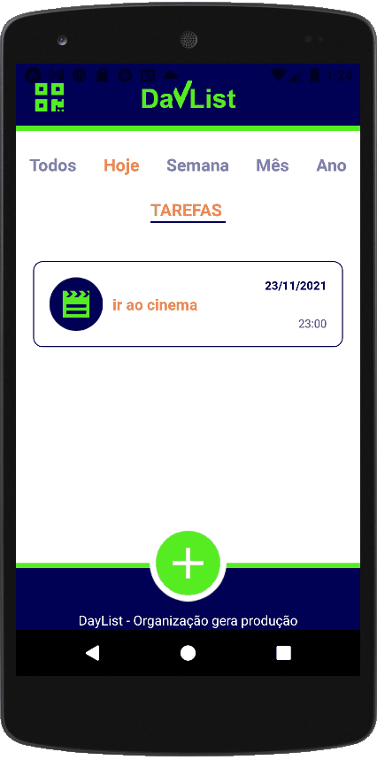

<h1 align="center">
React-Native-DayList
</h1>

<p align="center">
  <a href="https://www.linkedin.com/in/leonascimentopro/">
      
  </a>
</p>


<div align="center">



</div>

## 🚀 Sobre o Projeto

APP de lista de tarefas criada com React Native e comsumindo uma API própria desenvolvida com NodeJS e utilizando o MongoDB, o projeto também tem um [versão web](https://github.com/leonascimeto/react-daylist) que deve ser integrado com o app via qrcode, o projeto é baseado em um curso de react e react native.

### 🛠 Tecnologias

As seguintes ferramentas foram usadas na construção do projeto:

- [React Native](https://reactnative.dev/)
- [React](https://pt-br.reactjs.org/)
- [axios](https://www.npmjs.com/package/axios)
- [date-fns](https://date-fns.org/)
- [expo](https://expo.dev/)
- [babel](https://babeljs.io/)

### Features

- [x] integração com versão web
- [x] consumo de api com axios
- [x] tela de listagem de tarefas com filtro
- [x] icone de notificação de tarefas atrasadas
- [x] scanner de qrcode

## 🚀 Como rodar este projeto

- Para clonar e executar este aplicativo, você precisará de [Git](https://git-scm.com), [NodeJs][nodejs] Instalado em seu computador.
- Necessário executar API do projeto, segue o link do repositório: [API DAYLIST](https://github.com/leonascimeto/node-daylist).
- Ter o Expo instalado de forma global.
- Possuir um disposito ou emulador Android/IOS.
- o arquivo src/services/api.js a contante baseURL deve ser alterada para o IP da rede local.


### 🌀 Clonando o repositório

```bash
# Clone este repositório
$ git clone https://github.com/leonascimeto/react-native-daylist.git

# Acesse a pasta do projeto no terminal/cmd
$ cd react-native-daylist
```

### 🧭 Rodando a aplicação web

```bash
# Instale as dependências
$ npm install

# Execute a Aplicação
$ npm start

```

Desenvolvido por Leonardo Fernandes 👨‍💻 [Entre em contato!](https://www.linkedin.com/in/leonascimentopro/)
